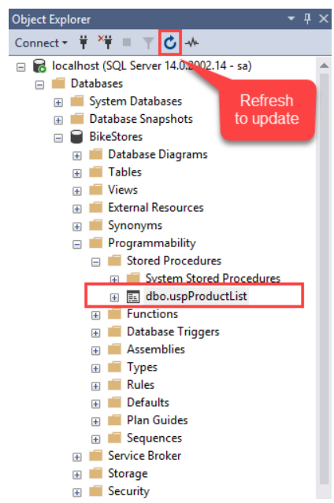
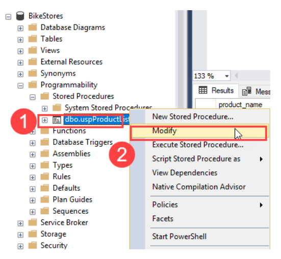

# What is stored procedure in SQL?

SQL Server stored procedures are used to group one or more Transact-SQL statements into logical units. The stored procedure is stored as a named object in the SQL Server Database Server.

When you call a stored procedure for the first time, SQL Server creates an execution plan and stores it in the cache. In the subsequent executions of the stored procedure, SQL Server reuses the plan to execute the stored procedure very fast with reliable performance

**Reusability:** You can save a complex SQL query as a stored procedure and call it whenever needed, reducing the need to rewrite the same query multiple times.

**Performance:** Since stored procedures are precompiled, they can execute faster than individual SQL queries.

**Security:** Stored procedures can help control access to data by granting permissions to execute the procedure without giving direct access to the underlying tables.

**Maintainability:** Changes to the logic can be made in one place (the stored procedure) rather than updating multiple queries across the application.

# Creating a simple stored procedure
The following SELECT statement returns a list of products from the products table in the BikeStores
```sql
SELECT 
	product_name, 
	list_price
FROM 
	production.products
ORDER BY 
	product_name;

```
To create a stored procedure that wraps this query, you use the CREATE PROCEDURE statement as follows:
```sql
CREATE PROCEDURE uspProductList
AS
BEGIN
    SELECT 
        product_name, 
        list_price
    FROM 
        production.products
    ORDER BY 
        product_name;
END;

```

In this syntax:

The `uspProductList` is the name of the stored procedure.

The `AS` keyword separates the heading and the body of the stored procedure.

If the stored procedure has one statement, the `BEGIN` and `END` keywords surrounding the statement are optional. However, it is a good practice to include them to make the code clear.

Note that in addition to the `CREATE PROCEDURE` keywords, you can use the `CREATE PROC` keywords to make the statement shorter.



# Executing a stored procedure

`EXECUTE sp_name;` (or) `EXEC sp_name;`

`EXEC uspProductList;`


# Modifying a stored procedure


```sql
 ALTER PROCEDURE uspProductList
    AS
    BEGIN
        SELECT 
            product_name, 
            list_price
        FROM 
            production.products
        ORDER BY 
            list_price 
    END;
```
# Deleting a stored procedure
`DROP PROCEDURE sp_name;`
(or) 
`DROP PROC sp_name;` 

# SQL Server Stored Procedure Parameters

## Creating a stored procedure with one parameter

```sql
ALTER PROCEDURE uspFindProducts(@min_list_price AS DECIMAL)
AS
BEGIN
    SELECT
        product_name,
        list_price
    FROM 
        production.products
    WHERE
        list_price >= @min_list_price
    ORDER BY
        list_price;
END;
```
Executing a stored procedure with one parameter

`EXEC uspFindProducts 100;`

# Creating a stored procedure with multiple parameters
```sql
ALTER PROCEDURE uspFindProducts(
    @min_list_price AS DECIMAL
    ,@max_list_price AS DECIMAL
)
AS
BEGIN
    SELECT
        product_name,
        list_price
    FROM 
        production.products
    WHERE
        list_price >= @min_list_price AND
        list_price <= @max_list_price
    ORDER BY
        list_price;
END;
```
`EXECUTE uspFindProducts 900, 1000;`


# Using named parameters
In case stored procedures have multiple parameters, it is better and more clear to execute the stored procedures using named parameters.

For example, the following statement executes the uspFindProducts stored procedure using the named parameters `@min_list_price` and `@max_list_price`:

EXECUTE uspFindProducts 
    @min_list_price = 900, 
    @max_list_price = 1000;

# Creating optional parameters
```sql
ALTER PROCEDURE uspFindProducts(
    @min_list_price AS DECIMAL = 0
    ,@max_list_price AS DECIMAL = 999999
    ,@name AS VARCHAR(max)
)
AS
BEGIN
    SELECT
        product_name,
        list_price
    FROM 
        production.products
    WHERE
        list_price >= @min_list_price AND
        list_price <= @max_list_price AND
        product_name LIKE '%' + @name + '%'
    ORDER BY
        list_price;
END;
```
```sql
EXECUTE uspFindProducts 
    @name = 'Trek';
```

# Stored Procedure Output Parameters
```sql
CREATE PROCEDURE uspFindProductByModel (
    @model_year SMALLINT,
    @product_count INT OUTPUT
) AS
BEGIN
    SELECT 
        product_name,
        list_price
    FROM
        production.products
    WHERE
        model_year = @model_year;

    SELECT @product_count = @@ROWCOUNT;
END;

```
# Calling stored procedures with output parameters
```sql
DECLARE @count INT;

EXEC uspFindProductByModel
    @model_year = 2018,
    @product_count = @count OUTPUT;

SELECT @count AS 'Number of products found';
```

# One stored procedure can call other stored procedure
Let’s create an example using the BikeStores database. We’ll create two stored procedures: one to calculate the total cost of an order (CalculateOrderTotals) and another to process an order (ProcessOrder) that calls the first stored procedure.

# Step 1: 
Create the CalculateOrderTotals Stored Procedure
This stored procedure calculates the total cost of an order based on the quantity and price of items ordered.

```sql
CREATE PROCEDURE CalculateOrderTotals
    @OrderID INT
AS
BEGIN
    DECLARE @TotalCost DECIMAL(10, 2);

    SELECT @TotalCost = SUM(oi.quantity * p.list_price)
    FROM sales.order_items oi
    JOIN production.products p ON oi.product_id = p.product_id
    WHERE oi.order_id = @OrderID;

    UPDATE sales.orders
    SET total_cost = @TotalCost
    WHERE order_id = @OrderID;
END;

```

# Step 2:
 Create the ProcessOrder Stored Procedure

 This stored procedure processes an order by calling the CalculateOrderTotals stored procedure and then updating the order status.
```sql
 CREATE PROCEDURE ProcessOrder
    @OrderID INT
AS
BEGIN
    -- Call the CalculateOrderTotals stored procedure
    EXEC CalculateOrderTotals @OrderID;

    -- Update the order status to 'Processed'
    UPDATE sales.orders
    SET order_status = 'Processed'
    WHERE order_id = @OrderID;
END;
```
To process an order with OrderID 1, you would execute the ProcessOrder stored procedure like this:
`EXEC ProcessOrder @OrderID = 1;`

```sql
--synax to create stored procedure

CREATE/ALTER PrOCEDURE ProcedureName
AS
BEGIN 
Procedure Body
END 


-- Example:1

CREATE PROCEDURE uspDisplayMessage
AS
BEGIN
PRINT 'welcome to .Net React Session!..'
END

EXECUTE uspDisplayMessage 
(or)
EXEC uspDisplayMessage
(or) 
uspDisplayMessage


Select * from production.products

create proc uspProductList
AS
BEGIN
select Product_name,list_price from production.products
order by product_name
END

drop procedure uspProductList

exec uspProductList

sp_help uspProductList


USE BikeStores;
GO
EXEC sp_databases;


--Alter procedure
ALTER PROC uspProductList
AS
BEGIN
select Product_name,model_year,list_price from
production.products order by list_price desc
END

uspProductList


exec sp_rename 'uspProductList', 'uspMyProductList'

-- parameter in Stored Procedure
/*input paramater
output parameter
*/

CREATE PROC uspFindProducts(@modelyear as int)
AS
BEGIN
SELECT * from production.products where model_year=@modelyear
END

uspFindProducts 2019


-- Example 4 with multiple parameter
CREATE PROC uspFindProdcutsbyRange(@minPrice decimal,@maxPrice decimal)
AS
BEGIN
SELECT * from production.products where 
list_price>=@minPrice AND 
list_price<=@maxPrice
END;

uspFindProdcutsbyRange 100,3000

--using named Parameter

uspFindProdcutsbyRange 
@maxPrice=12000,
@minPrice=5000

--optional parameter
CREATE PROC uspFindProductsByName
(@minPrice as decimal =2000,@maxPrice decimal,@name as varchar(max))
AS
BEGIN
select * from production.products where list_price>=@minPrice and 
list_price<=@maxPrice
and 
product_name like '%'+@name+'%'
END

uspFindProductsByName 100,1000,'Sun'

uspFindProductsByName @maxPrice=3000,@name='Trek'


-- out Parameter

CREATE PROCEDURE uspFindProductCountByModelYear
(@modelyear int,
@productCount int OUTPUT
)
AS
BEGIN
select Product_name,list_Price 
from production.products 
WHERE 
model_year=@modelyear

select @productCount=@@ROWCOUNT
END


DECLARE @count int;

EXEC  uspFindProductCountByModelYear @modelyear=2016,@productCount=@count OUT;;

select @count as 'Number of Products Found';

--can one stored procedure call another stored procedure


CREATE PROC usp_GetAllCustomers
AS
BEGIN
select * from sales.customers
END

sp_rename 'usp_GetAllCunstomers','usp_GetAllCustomers'

usp_GetAllCustomers


CREATE PROC	usp_GetCusotmerOrders
@customerId INT
AS
BEGIN
SELECT *  FROM sales.orders 
WHERE
customer_id=@customerId 
END


usp_GetCusotmerOrders  1


ALTER PROC usp_GetCustomerData
(@cusomterId INT)
AS
BEGIN
EXEC usp_GetAllCustomers;
EXEC usp_GetCusotmerOrders @cusomterId;
END

exec usp_GetCustomerData 1

create procedure getAllCustomers
as
begin
select * from sales.customers
end
exec getAllCustomers

CREATE PROCEDURE getCustomersByProduct
    @ProductID INT
AS
BEGIN
    SELECT 
        c.customer_id, 
        c.first_Name, 
        o.order_date
    FROM 
        sales.customers c
    JOIN 
        sales.orders o ON c.customer_id = o.customer_id
    JOIN 
       sales.order_items  od ON o.order_id = od.order_id
    WHERE 
        od.product_id = @ProductID;
END


exec getCustomersByProduct 4


select * from sales.orders
select * from sales.order_items

select * from production.products

```