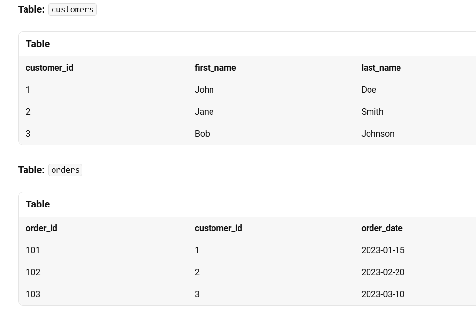
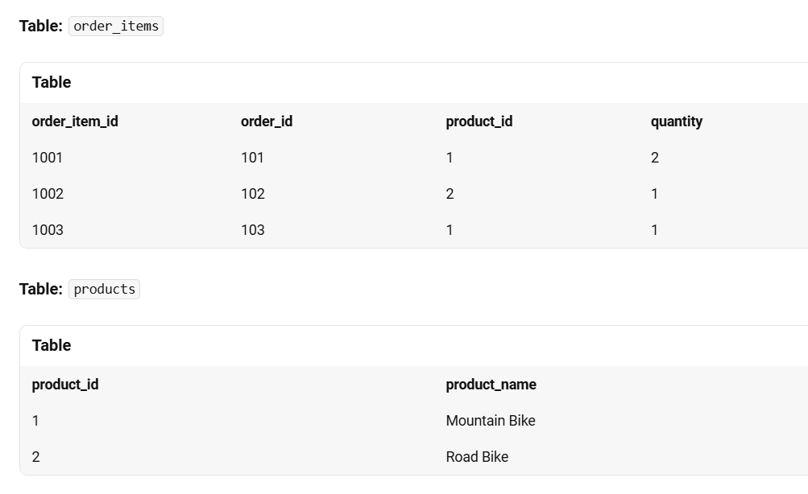

# Subquery 
query within the query is called as subquery . Inner query wil execute
first and it produces output. That output act as input to your outer query.
Here inner query will execute independently


# co-related Subquery

query within the query ,inner query depends on outer query .so inner query is not executing independently


```sql
CREATE TABLE products (
    product_id INT PRIMARY KEY,
    product_name VARCHAR(50),
    category_id INT,
    price DECIMAL(10, 2)
);

INSERT INTO products (product_id, product_name, category_id, price) VALUES
(1, 'Laptop', 1, 1000.00),
(2, 'Mouse', 2, 50.00),
(3, 'Keyboard', 2, 80.00),
(4, 'Monitor', 1, 300.00),
(5, 'Printer', 3, 150.00);

```

```sql
CREATE TABLE employees (
    employee_id INT PRIMARY KEY,
    first_name VARCHAR(50),
    last_name VARCHAR(50),
    department_id INT,
    salary DECIMAL(10, 2)
);
INSERT INTO employees (employee_id, first_name, last_name, department_id, salary) VALUES
(1, 'John', 'Doe', 1, 5000.00),
(2, 'Jane', 'Smith', 2, 6000.00),
(3, 'Bob', 'Johnson', 1, 4500.00),
(4, 'Alice', 'Davis', 2, 7000.00),
(5, 'Charlie', 'Brown', 3, 5500.00);

```

# subquery Example
Find all products that have a price higher than the average price of all products.
```sql
SELECT product_name, price
FROM products
WHERE price > (SELECT AVG(price) FROM products);
```
In this example, the subquery (SELECT AVG(price) FROM products) calculates the average price of all products. The outer query then selects products with a price higher than this average.

# Correlated Subquery 
A correlated subquery is a subquery that uses values from the outer query.

Find employees whose salary is higher than the average salary in their department.
```sql
SELECT employee_id, first_name, last_name, salary
FROM employees e
WHERE salary > (SELECT AVG(salary) 
                FROM employees 
                WHERE department_id = e.department_id);

```

In this example, the subquery (SELECT AVG(salary) FROM employees WHERE department_id = e.department_id) calculates the average salary for the department of each employee in the outer query. The outer query then selects employees whose salary is higher than this average.

# Example 1: Find Customers Who Have Purchased a Specific Product
Let’s say we have the following tables:


Query
Find customers who have purchased a “Mountain Bike”.
```sql
SELECT first_name, last_name
FROM sales.customers
WHERE customer_id IN (
    SELECT customer_id
    FROM sales.orders
    WHERE order_id IN (
        SELECT order_id
        FROM sales.order_items
        WHERE product_id = (
            SELECT product_id
            FROM production.products
            WHERE product_name = 'Sun Bicycles Drifter 7 - 2017'
        )
    )
);
```
#Example 2: Find Products That Have Never Been Ordered
Query
Find products that have never been ordered by any customer.
```sql
SELECT product_name
FROM production.products
WHERE product_id NOT IN (
    SELECT product_id
    FROM sales.order_items
);

```